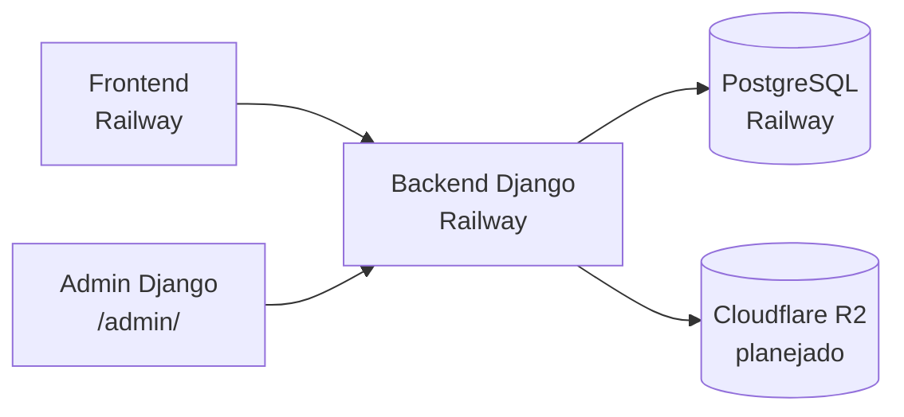

# Arquitetura

## Visão geral do sistema



## Componentes

| Componente | Tecnologia | Status |
|---|---|---|
| Frontend | A definir pelo time frontend | Externo |
| Backend API | Django 5.2 + Gunicorn | Implementado |
| Banco de dados | PostgreSQL (produção) / SQLite (local) | Implementado |
| Armazenamento de músicas | Cloudflare R2 | Planejado |
| Hospedagem | Railway | Implementado |

## Responsabilidades do backend

- Expor endpoints HTTP para o frontend
- Persistir dados no PostgreSQL
- Gerenciar upload/download de arquivos de áudio (futuro, via R2)
- Autenticação e autorização (futuro)
- Painel administrativo interno (`/admin/`)

## O que o frontend **não** deve consumir

| Recurso | Motivo |
|---|---|
| `/admin/` | Interface HTML do Django Admin — uso interno/backoffice |
| `DATABASE_URL` | Credencial de banco — nunca expor no frontend |
| Variáveis `DJANGO_SUPERUSER_*` | Credenciais de bootstrap — apenas no deploy |

## Fluxo de deploy (backend)

1. Railway executa migrações (`python manage.py migrate`)
2. Railway cria/atualiza superusuário (`python manage.py ensure_superuser`)
3. Gunicorn inicia o servidor WSGI na porta `$PORT`

## Estrutura do repositório

```
backend_jukebox/
├── config/              # Configurações Django
│   ├── settings.py
│   ├── urls.py
│   └── views.py
├── docs/                # Esta documentação
├── manage.py
├── Procfile
├── railway.toml
└── requirements.txt
```
